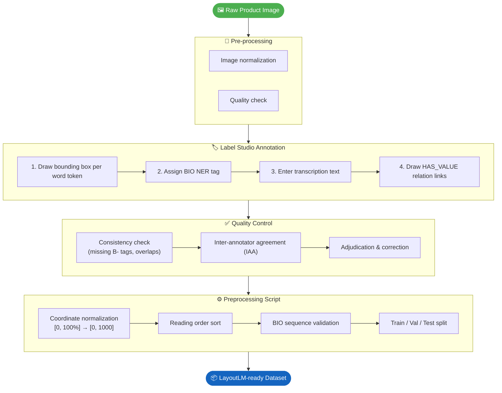

# Annotation Pipeline

## Workflow



## Stage Details

### 1. Pre-processing
- Images are resized to a maximum of 1600px on the longer axis while preserving aspect ratio.
- Blurry, corrupted, or duplicate images are removed before annotation begins.

### 2. Label Studio Annotation

Each annotator performs four steps per image:

| Step | Action |
|---|---|
| Bounding box | Draw a tight rectangle around each **individual word token** |
| NER tag | Assign the correct `B-` or `I-` label from the entity schema |
| Transcription | Type the exact text content of the token (case-sensitive, with diacritics) |
| Relations | Draw `HAS_VALUE` arrows from each `B-NUTRITION_NAME` to its `B-NUTRITION_VALUE` |

See [entity-schema.md](entity-schema.md) and [relation-schema.md](relation-schema.md) for labeling rules.

### 3. Quality Control

- **Automated consistency check**: script flags
  - `I-X` tokens with no preceding `B-X` in the same entity span
  - Overlapping bounding boxes assigned different entity types
  - Relations not originating from a `B-` token
- **Inter-Annotator Agreement (IAA)**: A random 10% subset is double-annotated. Cohen's κ is computed at token level.
- **Adjudication**: Disagreements are resolved by a lead annotator.

### 4. Preprocessing Script

#### Coordinate Normalization

Label Studio stores coordinates as **percentages (0–100%)** of the image dimensions. LayoutLM requires coordinates normalized to **[0, 1000]**:

```python
x0 = int(item['value']['x'] / 100 * 1000)
y0 = int(item['value']['y'] / 100 * 1000)
x1 = int((item['value']['x'] + item['value']['width'])  / 100 * 1000)
y1 = int((item['value']['y'] + item['value']['height']) / 100 * 1000)
```

#### Reading Order Sort

Tokens are sorted into natural reading order (top-left → bottom-right) by grouping into row buckets and sorting by x within each row:

```python
tokens.sort(key=lambda t: (round(t['y0'] / 10) * 10, t['x0']))
```

The `/ 10 * 10` bucket size groups tokens within the same visual line even when their y-coordinates differ slightly due to font baseline variation.
